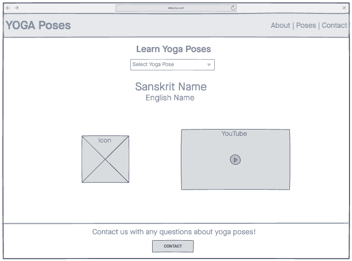

# Yoga Poses

## Introduction

As simple web-application where you can view yoga poses with how-to YouTube videos. If you have any questions on the poses, you can email for help.

## Technologies Used

- HTML5
- CSS3
- Express.js
- Node.js
- React.js
- React-Player
- Nodemailer with Express
- Google Fonts
- Yoga API

## WireFrames

## Screenshots

## Getting Started

- [Click Here] to see the deployed app!
- From the home page, you can click to the poses page and the contact page.

## Future Enhancements

- Add pagination or a dropdown for each pose
